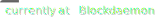

  

    <strong>Hi, I'm Richard. :wave:</strong>
  

  

## Work

- Research Engineer at [@Blockdaemon](https://github.com/Blockdaemon).
- Working on blockchain node infrastructure on cloud & bare-metal.
- Building Eth2 distributed validators at [Obol Network](https://obol.tech).

## Contact

Feel free to reach out if you want to talk about code.

Job offers and support requests on my open-source software go straight to the spam folder.

## Keywords

I'm good at — in no particular order — Go, Rust, C, Lua, LuaJIT, Python, NGINX, Envoy, Solana, Eth2, PowerPC, Debian, Google Cloud, Terraform, Ansible, K8s, Docker, PostgreSQL, Redis, Kafka, Apache Cassandra, Prometheus, Thanos, VictoriaMetrics, Web, Vue, Mario Kart Wii

Working to get better at — eBPF, Linux kernel, x86
